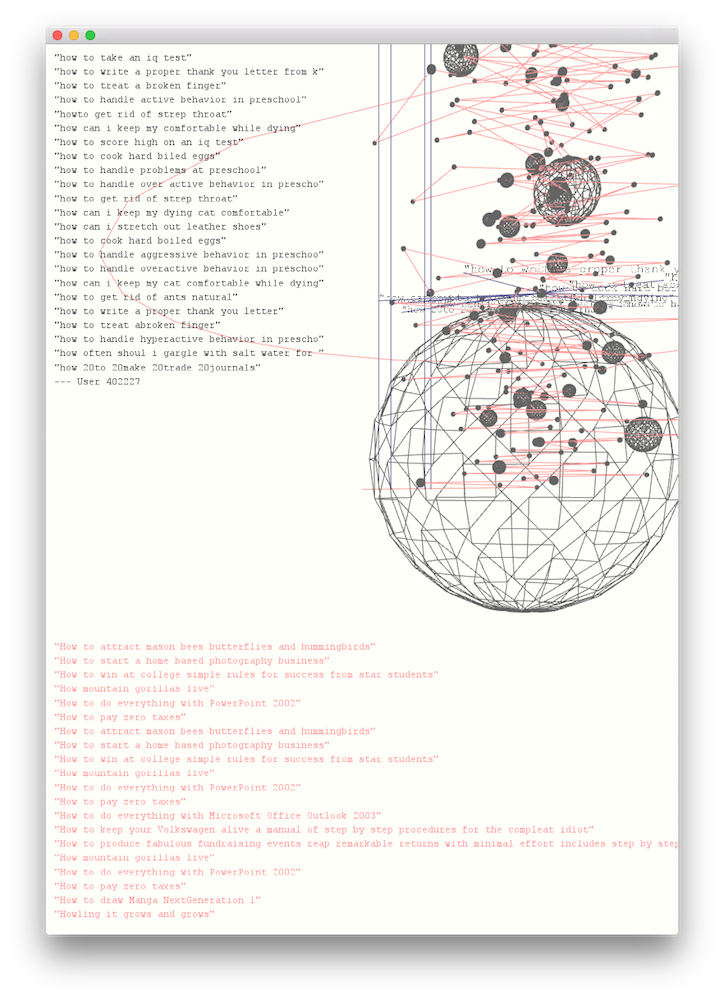
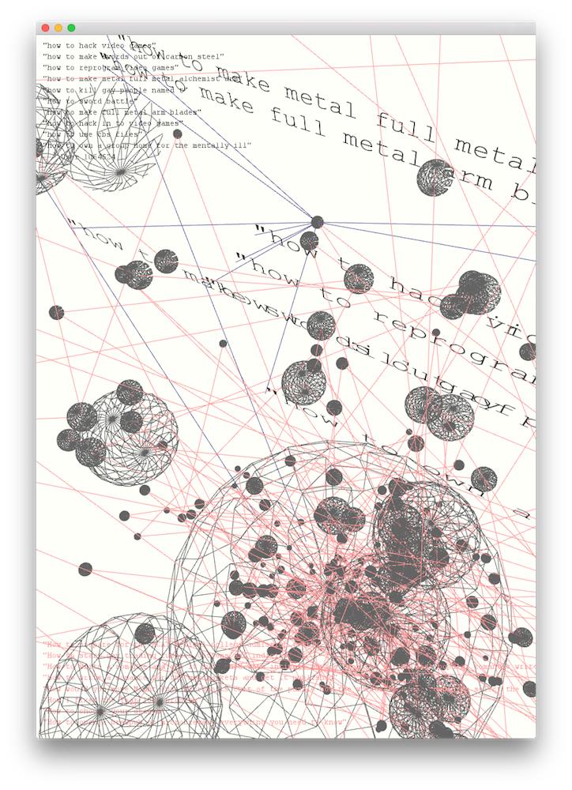

This is an [openFrameworks 0.90+](http://openframeworks.cc/) project. Please integrate the `src` and `bin/data` folders into a new project. Dependencies: ofxCSV, version 0.13: [https://github.com/paulvollmer/ofxCsv/releases/tag/v0.1.3](https://github.com/paulvollmer/ofxCsv/releases/tag/v0.1.3).

# "How 11 Year Olds Get Girls" or Advice in Times of the Internet (2015)

In 1998, in an effort to legislate Internet pornography, the so called [Child Online Protection Act (COPA)](href="http://en.wikipedia.org/wiki/Child_Online_Protection_Act) was passed. In 2006, the Department of Justice, trying to enforce the newly created law, demanded access to the search logs of all major Internet search engines, including Google. Google took legal action ([Gonzales vs. Google](http://news.findlaw.com/nytimes/docs/google/gonzgoog11806m.html)) which eventually (2009) lead to the act being struck down as unconstitutional, after a long journey through the courts. Several other search engines complied and delivered the requested "multi-stage random sample of one million URLs" from their database, and a computer file with "the text of each search string entered onto the search engine over a one-week period (absent any information identifying the person who entered such query)." One search engine though, AOL, went a step further and decided to not only make its data available, but to make it publicly available. So, according to [Wikipedia](http://en.wikipedia.org/wiki/AOL_search_data_lea), on August 4, 2006, AOL Research released a compressed text file on one of its websites containing twenty million search keywords for over 650,000 users over a 3-month period, intended for research purposes. AOL deleted the search data on their site by the 7th, but not before it had been mirrored and distributed on the Internet.

The ensuing public outrage that AOL, somehow, had not anticipated, mainly focused on the badly implemented anonymization of the data. While users were assigned random IDs, their search history still revealed so much information that they became recognizable again. It was the New York Times that first [publicly revealed](http://www.nytimes.com/2006/08/09/technology/09aol.html) -- with her consent -- the identity of a user, no. 4417749, on August 9, 2006. At AOL, The people responsible for the leak were let go and a [written apology](http://news.cnet.com/AOL-apologizes-for-release-of-user-search-data/2100-1030_3-6102793.html) was published

For the rest of the year 2006, lots of people worked with the AOL data, identifying, amongst others, [a potential murderer](https://web.archive.org/web/20160523194440/https://plentyoffish.wordpress.com/2006/08/07/aol-search-data-shows-users-planning-to-commit-murder/) (Internet Archive link). A class action law suit, filed in September 2006, however, put an end to this exploration. Where possible, data sources were removed, the few sources left were killed by time (both on web servers and in file sharing networks).

For this project, I am correlating the AOL search log data with the Seattle Public Library data from the same time period, March 1 - May 31, 2006. I look at "advice" given by the Internet and the books in the library by simply querying both data sources for the word "how".

I was immediately captivated by the strange poetry of the search queries themselves and the users portrayed by them. The "poems" generated from both data sources by exploring the visualization are stunning examples of "automated" poetry. Here is a love poem by user 2708:

>'2708', 'how to drive someone crazy', '2006-03-03 17:09:27' 
'2708', 'how to say goodbye hurtfully', '2006-03-05 20:45:09' 
'2708', 'how to send junk mail to someone else', '2006-03-18 16:22:04' 
'2708', 'how to permantlly delete information from you', '2006-03-19 14:35:57' 
'2708', 'how to send email anonymously', '2006-03-21 19:43:35' 
'2708', 'how to humiliate someone', '2006-03-03 07:47:13' 
'2708', 'how to get revenge on an old lover', '2006-03-03 17:15:12' 
'2708', 'how to report child neglect in the state of n', '2006-03-11 17:01:51' 
'2708', 'how to send things anounmously', '2006-03-19 12:47:27' 
'2708', 'how to permanently delete information from yo', '2006-03-19 14:36:13' 
'2708', 'how to stop loving someone', '2006-03-21 23:16:51' 
'2708', 'how humiliate someone', '2006-03-03 16:56:05' 
'2708', 'how to really make someone hurt for the pain ', '2006-03-03 17:22:50' 
'2708', 'how to get back on an ex lover', '2006-03-18 15:53:45' 
'2708', 'how to send things anonymously', '2006-03-19 12:47:33' 
'2708', 'how to send alot of junk mail to someonne wit', '2006-03-21 19:41:29' 
'2708', 'how to make someone misreable', '2006-03-03 17:05:12' 
'2708', 'how to make an old lover suffer', '2006-03-05 15:02:13' 
'2708', 'how to move on from a broken heart', '2006-03-18 16:01:28' 
'2708', 'how to ruin someone's credit', '2006-03-19 13:19:47'

I decided to work in A4 (portrait), creating an "analog" interface that takes up graphical elements and color schemes from hand-written plans and diagrams (delicate lines, blue, black, and red ink on slightly toned down white paper) while still being three-dimensional, interactive, and animated. I deliberately included the possibility for text, set in a serifed typewriter font, to overlap, fade, and disappear. I experimented with several basic geometric shapes and finally ended up with a "galaxy" like arrangement of elements that coherently represents the data. The spheres are single users with their search queries orbiting around them. The vertical lines are books checked out from the Seattle Public Library in the same time period.
